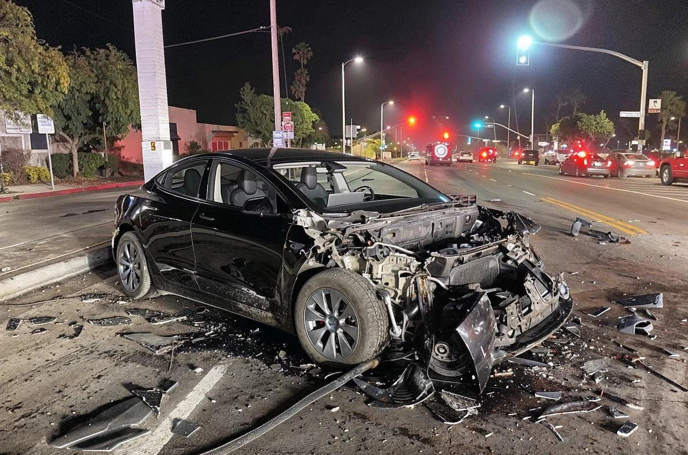
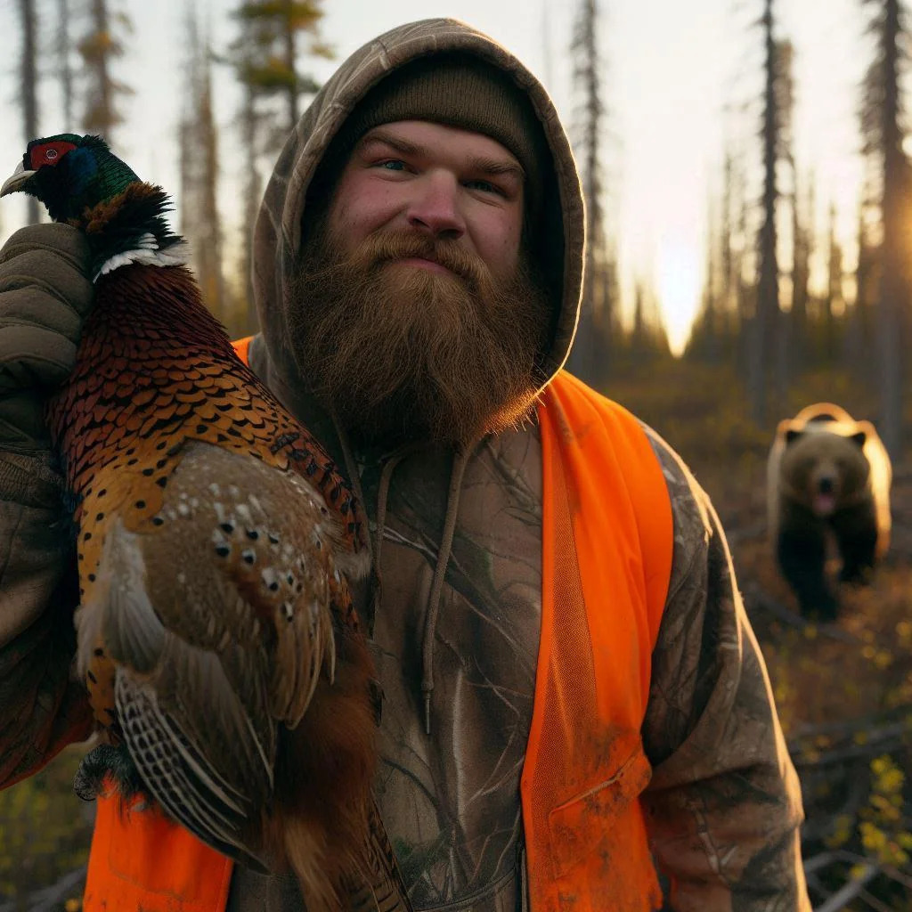
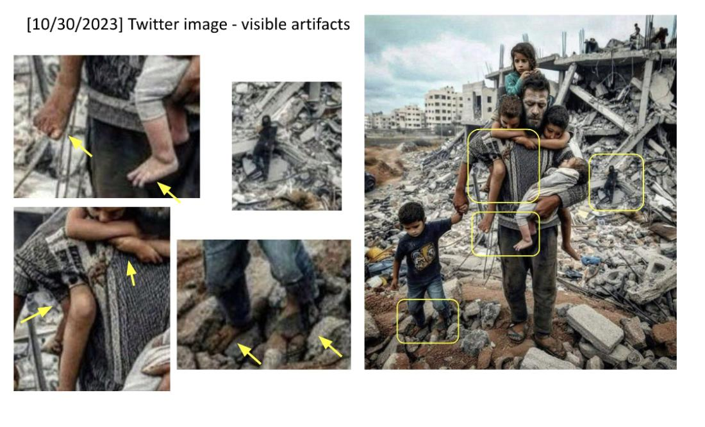

# Identifying Synthetic Content 

## SECTION 0: LEARNING EXPERIENCE OVERVIEW

### Learning experience Information

**Learning experience Title**: Identify Synthetic Media Content

**Program of Instruction (POI)**: Counter Malign Influence / Version 1.0

**Developer Point of Contact**: first.last@email.tld

### IMPORTANT

#### Training Material Classification: UNCLASSIFIED

### Distribution Restriction:

- A. Approved for public release; distribution is unlimited.

### Destruction Notice:

- N/A for the project: automatically rendered based on Distribution Restriction

### Foreign Disclosure:

- FD1 - This training product has been reviewed by the training developer in coordination with the TRADOC foreign disclosure officer. This training product can be used to instruct international military students in all approved countries.

### SCOPE OF LEARNING EXPERIENCE

This 120-minute learning experience is an intermediate orientation to recognizing AI-generated content. The end state of this learning experience is for students to be able to recall and apply the necessary steps to effectively identify synthetic media content. The author's intent is that students learn key principles and procedures through a series of scenario-based exercises. By the end of the learning experience, students should have a solid grasp of the actions to take in the relevant scenarios involving possible synthetic media content. This learning experience is common to all  and links to other parts of the curriculum by reinforcing the character attributes of accountability and responsibility.

### Learning Objectives

#### Terminal Learning Objective (TLO):

> **Action**: Identify Synthetic Media Content
> **Condition**: Given an environment that allows the students to engage one another and the cadre openly, handouts, visual aids, research capabilities, and Synthetic Content detection tools.
> **Standard**: Accurately identify AI-generated content by detecting inconsistencies and manipulation artifacts, ensuring that at least 90% of assessments are correct and report findings to the relevant authorities.

#### Enabling Learning Objective (ELO) / Learning Step Activity (LSA):

> **Action**: Detect inconsistencies in images
> **Condition**: Given example images, detection tools, and visual aids.
> **Standard**: Correctly identify at least 90% of AI-generated images.

> **Action**: Identify manipulation artifacts in text
> **Condition**: Given example text passages and analysis tools.
> **Standard**: Correctly identify at least 90% of manipulated text passages.

> **Action**: Analyze audio content for consistency
> **Condition**: Given audio samples and analysis tools.
> **Standard**: Correctly identify at least 90% of AI-generated audio samples.

### References

1. [Media Lab at MIT on Detecting Fakes](https://www.media.mit.edu/projects/detect-fakes/overview/)
2. [Detect Fakes with Kellogg's online tool](https://detectfakes.kellogg.northwestern.edu/)
3. [CISA Contextualizing Deepfake Threats to Organizations](https://media.defense.gov/2023/Sep/12/2003298925/-1/-1/0/CSI-DEEPFAKE-THREATS.PDF)
4. [DARPA: Deepfake Defense Tech Ready for Commercialization, Transition](https://www.darpa.mil/news-events/2024-03-14#:~:text=Through%20the%20Semantic%20Forensics%20)
5. [Scribbr AI Detector](https://www.scribbr.com/ai-detector/)

## SECTION 1: ADMINISTRATIVE DATA

### Instructional Guidance

**Conduct of Learning experience**: 

**NOTE:** Before presenting this learning experience, instructors must thoroughly prepare by studying this learning experience and identifying reference material.

- Review the learning experience plan and all related materials.
- Set up the classroom with the necessary equipment and materials.
- Familiarize yourself with the detection tools and example media content.

### 1. The importance of this learning experience:

Understanding and identifying synthetic media content is critical to maintaining operational security and countering misinformation.

### 2. What we want our students to Achieve:

Students should be able to accurately detect AI-generated content and report their findings.

### 3. A Possible Technique to Achieve the Outcome

1. Use a combination of visual, textual, and audio analysis tools to detect inconsistencies.

### 4. AAR Guidance for this Learning experience

1. Conduct After-Action Reviews (AAR) after each major activity to capture learning experiences learned and reinforce key points.

### Learning experience Requirements

#### Instructor Requirements

An instructor must:

1. Review the entire learning experience plan for each learning experience they will cover.
2. Be able to obtain, access, and be familiar with the required material and equipment.
3. Read and understand the referenced material.

An instructor must attend the following training:

1. TRADOC certified instructor course.
2. Course on AI and synthetic media.

An instructor should:

1. Have received this block of instruction as a student.
2. Participated in this instruction as an assistant instructor for this learning experience.
3. Participated in the AAR for this learning experience.

#### Additional Support

##### Required or Requested Support

N/A

##### Guidance for Assistant Instructors

Assist with classroom setup, help facilitate group discussions, and provide one-on-one support to students as needed.

### Equipment and Material Required for Instruction

| Equipment                        | Student Ratio | Instructor Ratio | Quantity | Expendable |
| -------------------------------- | ------------- | ---------------- | -------- | ---------- |
| Computer                         | 1:1           | 1:2              |          | no         |
| Slides                           |               |                  | 1        | no         |
| Projector                        |               |                  | 1        | no         |
| Example images, text, audio      |               |                  |          | no         |

### Pre-Requisite Tasks

1. Review basic concepts of AI and machine learning.

### Knowledge Required

1. Basic understanding of AI and machine learning existence and capabilities.

### Skills Required

1. Ability to use computer and analysis tools.
2. Ability to use the internet to research information.
3. Ability to create synthetic content with AI tools.

## Supporting Tasks

### Tasks Taught

1. Identifying visual inconsistencies in images.
2. Detecting manipulation artifacts in text.
3. Analyzing audio content for consistency.

### Tasks Supported

1. Reporting synthetic media content.

### Tasks Reinforced

1. Critical analysis and attention to detail.

## Learning experience Timeline

| Academic (y/n) | Broad Topic                   | EST TIME Min | Methods                        | Slide Range |
| -------------- | ----------------------------- | ------------ | ------------------------------ | ----------- |
| Instructor     |                               | 5            | Instructor Rehearsal           | -           |
| Instructor     |                               | 0            | Classroom Setup                | -           |
| y              | Concrete Experience           | 15           | Spotting Differences           | 1-3         |
| y              | Publish and Process           | 5            | Discussion on Observations     | 4-5         |
| y              | Generalize New Information    | 60           | Techniques for Detecting AI    | 6-12        |
| y              | Develop                       | 20           | Applying Detection Techniques  | 13-18       |
| y              | Apply                         | 30           | Practical Exercise             | 19-20       |
| y              | Assessment / Check On Learning| 10           | Summary and Feedback           | 21-23       |

## SECTION 2: LEARNING EXPERIENCE INTRODUCTION

**Concrete Experience / Motivator:** 
NOTE: This concrete experience is designed to engage students and introduce the topic of Synthetic Content detection.
NOTE: In this learning experience, Synthetic content means AI-generated content.
NOTE: Go to Slide 1

Students write down any differences they notice:

#### SLIDE 1
1. Display two sets of images, one original and one synthetic, and ask students to identify which is synthetic. [Image2-AI-Car.jpg](Audio_Visual-Identifying_Synthetic_Content/Image2-AI-Car.jpg) and [Image4-Real-Car.jpg](Audio_Visual-Identifying_Synthetic_Content/Image4-Real-Car.jpg) (5 minutes)
NOTE: Go to Slide 2

#### SLIDE 2
2. Display two sets of images, these are both real images but extraordinary in some way. Ask students to identify which is synthetic. [Image11-Real-Shy_Bird.jpeg](Audio_Visual-Identifying_Synthetic_Content/Image11-Real-Shy_Bird.jpeg) and [Image10-AI-Family.png](Audio_Visual-Identifying_Synthetic_Content/Image10-AI-Family.png) (5 minutes)

NOTE: Go to Slide 3

#### SLIDE 3
3. Display two sets of images, one original and one synthetic, and ask students to identify which is synthetic. [Image13-AI-Hospital.jpeg](Audio_Visual-Identifying_Synthetic_Content/Image13-AI-Hospital.jpeg) and [Image14-Real-Hospital_Group.jpeg](Audio_Visual-Identifying_Synthetic_Content/Image14-Real-Hospital_Group.jpeg) (5 minutes)
3. Students share their observations amoungst each other with the purpose being questioning their own ability to detect the synthetic content and comparing their techniques with others. (5 minutes)

NOTE: Go to Slide 7
NOTE: Several slides are left blank to allow tranitioning without revealing the answer.

#### SLIDE 7: All Images Displayed
Display all images at once reminding students of the images they tried to identify as synthetic in the concrete experience.

NOTE: Go to Slide 10 

#### SLIDE 10: Images Revealed
4. Reveal to the students which images were synthetic (Marked with X). Do NOT discuss the detection techniques used yet; instead, go to the publish and process phase. 

NOTE: Go to Slide 11

#### SLIDE 11: Learning experience Title
NOTE: Instructor transition while they have students' attention to the learning experience title which is the answer to the challenge presented in the concrete experience.
NOTE: Go to Slide 5

#### SLIDE 12: Learning experience Objectives
**Instructional Lead-in:** 
"The learning objectives for this block are to recognize AI-generated content effectively using specific detection techniques for images, text, and video."

NOTE: Instructor must say the following to the students as AI Generated is often not detectable by the human eye: 
"AI Generated Content is becoming increasingly sophisticated and harder to detect. There will be many situations where it is not possible to determine if content is AI-generated or not. More advanced technical tools and techniques are required to detect AI-generated content."

**Scope Statement:** During this 2-hour block of instruction, the students will learn to detect and analyze AI-generated content using structured analytic techniques. They will participate in practical exercises to apply these techniques and gain confidence in their ability to validate information sources.

## Publish and Process

1. Introduce the learning objectives.
2. Explain the significance of being able to detect and analyze AI-generated content.

## SECTION 3: LEARNING EXPERIENCE PRESENTATION

### Learning Step Activity (LSA) 1: Introduction to Synthetic Content Detection

NOTE: Go to Slide 13

#### SLIDE 13: Introduction to Synthetic Content Detection

**Learning Step Activity Text:**

> 1. **Overview of Synthetic Content Detection**: Present an overview of Synthetic Content detection techniques.
> 2. **Components of Synthetic Content Detection**: Explain each component - Visual Cues, Structural Consistency, Textual Analysis, Video Analysis.
> 3. **Memorization Activity**: Have students memorize the components of Synthetic Content detection.

**Activity**

1. Present an overview of Synthetic Content detection techniques. (5 minutes)
2. Explain each component in detail. (10 minutes)
3. Have students quiz each other to memorize the components. (5 minutes)

NOTE: Go to Slide 14

#### SLIDE 14: Visual Cues for Detection

**Learning Step Activity Text:**

> Identify visual cues that indicate AI-generated content.

**Activity**

1. Present examples of visual cues in AI-generated content:
    - Example: Extra fingers or limbs.
    - Example: Inconsistencies in facial features.
2. Discuss how to identify these cues in various scenarios:
    - Analyze hands and limbs for anomalies.
    - Evaluate facial features for unnatural smoothness or discrepancies.

NOTE: Go to Slide 15

#### SLIDE 15: Structural Consistency in Images

**Learning Step Activity Text:**

> Analyze structural consistency in buildings and scenes.

**Activity**

1. Present examples of structural inconsistencies in AI-generated content:
    - Example: Misaligned windows or doors.
    - Example: Sudden changes in texture.
2. Discuss how to identify structural inconsistencies in various scenarios:
    - Verify the consistency of structural elements.
    - Check for natural interaction of light with objects.

NOTE: Go to Slide 16

#### SLIDE 16: Synthetic Check: Human Image (Memorization)

**Activity**

1. Have students write down key points to remember for checking human images for synthetic characteristics.

NOTE: Go to Slide 17

#### SLIDE 17: Structure Image Check (Memorization)

**Activity**

1. Have students write down key points to remember for checking structural images for inconsistencies.

NOTE: Go to Slide 18

#### SLIDE 18: Structure Image Check (Answers Revealed)

**Activity**

1. Reveal the answers to the students, discussing each point in detail.

NOTE: Go to Slide 19

#### SLIDE 19: Synthetic Check: Human Image (Answers Revealed)

**Activity**

1. Reveal the answers to the students, discussing each point in detail.

### Learning Step Activity (LSA) 2: Detailed Analysis of Synthetic Content Detection Components

NOTE: Go to Slide 13

#### SLIDE 13: Human Images

**Learning Step Activity Text:**

> Identify visual cues specific to human images that indicate AI-generated content.

**Activity**

1. Present examples of visual cues in human images:
    - Example: Extra fingers or limbs.
    - Example: Inconsistencies in facial features.
2. Discuss how to identify these cues in various scenarios:
    - Analyze hands and limbs for anomalies.
    - Evaluate facial features for unnatural smoothness or discrepancies.

NOTE: Go to Slide 20

#### SLIDE 20: Human Images: Context

**Learning Step Activity Text:**

> Analyze the context of human images for AI-generated content.

**Activity**

1. Present examples of context anomalies in human images:
    - Example: Illogical scene context.
    - Example: Unnatural interactions between elements in the scene.
2. Discuss how to identify these context anomalies in various scenarios:
    - Evaluate the logic and flow of the scene.
    - Check for natural interactions and placements of elements.

NOTE: Go to Slide 21

#### SLIDE 21: Human Images: Hands and Limbs

**Learning Step Activity Text:**

> Focus on hands and limbs to detect AI-generated content in human images.

**Activity**

1. Present examples of anomalies in hands and limbs:
    - Example: Extra fingers or distorted limbs.
    - Example: Unnatural positions or proportions.
2. Discuss how to identify these anomalies in various scenarios:
    - Examine hands and fingers closely for extra or missing elements.
    - Check for natural positions and proportions of limbs.

NOTE: Go to Slide 22

#### SLIDE 22: Human Images: Face

**Learning Step Activity Text:**

> Pay attention to facial features to detect AI-generated content in human images.

**Activity**

1. Present examples of anomalies in facial features:
    - Example: Unnatural smoothness or texture.
    - Example: Inconsistencies in facial expressions or alignment.
2. Discuss how to identify these anomalies in various scenarios:
    - Evaluate the smoothness and texture of facial features.
    - Check for natural expressions and alignment of facial elements.

NOTE: Go to Slide 23

#### SLIDE 23: Human Images: Clothing

**Learning Step Activity Text:**

> Analyze clothing in human images to detect AI-generated content.

**Activity**

1. Present examples of anomalies in clothing:
    - Example: Repetition of patterns or textures.
    - Example: Unnatural folds or interactions with the body.
2. Discuss how to identify these anomalies in various scenarios:
    - Check for natural folds and interactions of clothing with the body.
    - Look for repetition of patterns or textures in clothing.

NOTE: Go to Slide 24

#### SLIDE 24: Human Image Check 
Have students write the steps to check human images for AI-generated content.

NOTE: Go to Slide 25
#### SLIDE 25: Revealing the Answers
Reveal the steps to check human images for AI-generated content.

### Human Images Check on Learning
NOTE: Go to Slide 26 
#### SLIDE 26: Practical Exercise: Human Images: Check On Learning 1
**Activity**
Have students apply the detection techniques to identify AI-generated content in human images.
Give students 3 minutes to analyze the images and identify any anomalies.

NOTE: This is a very difficult image to detect. Instructor should make a point that AI-generated content is becoming increasingly sophisticated and harder to detect.

The scene, consider the bear sneaking up on him (bears can be noisy) 
See the extra drawstring on the hoody
See the texture of the Visibility vest which is very different than outdoor gear

NOTE: Go to Slide 27
#### SLIDE 27: Reminder of Human Image Check Steps

NOTE: Go to Slide 28

#### SLIDE 28: Practical Exercise: Human Images: Check On Learning 2
Have students apply the detection techniques to identify AI-generated content in human images.
This image is much more difficult to detect and ambiguous. Students may leave this image uncertain based on the steps they have learned.

Instructor should make a point that AI-generated content is becoming increasingly sophisticated and harder to detect and that the steps are only a starting point. Not matching the steps does not mean the image is real and not matching the steps does not mean the image is synthetic.

NOTE: Give students 3 minutes to analyze the images and identify any anomalies.

NOTE: Go to Slide 29
#### SLIDE 29: Practical Exercise: Human Images: Check On Learning 2 (Reveal)
- The context of the bear behind the person should raise questions for this image. While possible that this is taken from a tripod it seems more likely that this picture is positioned as if taken by another; in which case they would be running away from the bear.
- The Sweater has 3 drawstrings which is not normal.
- The texture of the vest is different than the outdoor gear visible in the background.
- The eye of the pheasant seems inconsistent with a dead bird. 

NOTE: Go to Slide 30
#### SLIDE 30: Practical Exercise: Human Images: Check On Learning (Reveal)
Notice the hands
Notice how long the boys shoulder would need to be 
Notice the toes
Notice the dark figure in the background

NOTE: Go to Slide 31
#### SLIDE 31: Practical Exercise: Human Images: Check On Learning (Reveal)
- context of the could be consistent with a real image so it is not a given that this is synthetic.
- The hands of most people in the picture are completely wrong sometimes individuals have 3 hands or arms grabing itself.The shoulders are way too long.
- Children have only 3 toes on each foot or malformed digits. 
- The dark figure in the background is a dead body but appears to be upright not laying down.

NOTE: Go to Slide 32

## SECTION 3: LEARNING EXPERIENCE PRESENTATION

### Learning Step Activity (LSA) 3: Analyzing Structural Consistency

#### SLIDE 32: Structure Image Check Steps
Review the steps for checking structural consistency as a reminder.

**Learning Step Activity Text:**

> Analyze structural consistency in buildings and scenes for AI-generated content.

**Activity**

1. Present examples of structural inconsistencies in AI-generated content:
    - Example: Misaligned windows or doors.
    - Example: Sudden changes in texture.
2. Discuss how to identify structural inconsistencies in various scenarios:
    - Verify the consistency of structural elements.
    - Check for natural interaction of light with objects.

NOTE: Go to Slide 33

#### SLIDE 33: Structure Image Check Houthi Example 
Use this real example of a Houthi propaganda video to reinforce the steps.
- The crater seems too perfect and the context of where and how it is shared seems out of place.
- The image of the ship is missing debris that would be present in a real image.

NOTE: Go to Slide 34

#### SLIDE 34: Structure Image Check (Car Accident Example)

**Activity**

1. Present detailed examples of structural inconsistencies:
    - Perspective and geometry issues.
    - Repetition in details.
    - Nonsensical object placement.
    - Disrupted continuity.
2. Discuss each example in detail and how to spot these inconsistencies.

NOTE: Go to Slide 35

#### SLIDE 35: Structure Image Check (Practice)

**Activity**

1. Have students practice identifying structural inconsistencies in sample images.
    - Provide a set of images and ask students to identify any inconsistencies.
    - Discuss their findings as a group.

NOTE: Go to Slide 36

#### SLIDE 36: Structure Image Check (Group Analysis)

**Activity**

1. Divide students into groups and provide each group with a set of images.
    - Each group analyzes the images for structural inconsistencies.
    - Groups present their findings to the class.
    - Discuss the effectiveness of their detection methods.

NOTE: Go to Slide 37

### Learning Step Activity (LSA) 4: Detailed Analysis of Structural Consistency

#### SLIDE 37: Structure Image Check

**Learning Step Activity Text:**

> Reinforce the importance of structural consistency in detecting AI-generated content.

**Activity**

1. Review the key points of structural consistency:
    - Context of the scene.
    - Structural consistency.
    - Material texture.
    - Lighting and shadows.
    - Perspective and geometry.
    - Repetition in detail.
    - Missing elements.
    - Nonsensical object placement.
    - Disrupted continuity.
    - Anomalies in common patterns.
2. Discuss how these points apply to different types of images.

NOTE: Go to Slide 38

#### SLIDE 38: Structure Image Check (Check On Learning)
Have students call out the steps they would use to check this image for structural consistency. When all 8 steps are called out have them repeat them back to you.

NOTE: Go to Slide 39

#### SLIDE 39: Structure Image Check (Check On Learning Reveal)

NOTE: Go to Slide 40

### Learning Step Activity (LSA) 5: Practical Application and Development of TTPs for Video Analysis

#### SLIDE 40: Synthetic Video Check: Practical Exercise

**Learning Step Activity Text:**

> Apply detection techniques to analyze AI-generated video content and develop Tactics, Techniques, and Procedures (TTPs).

**Activity**

1. Search online for possible deepfake videos that have been in the news.
2. Analyze the video for inconsistencies:
    - Context of the scene.
    - Structural consistency.
    - Material texture.
3. Determine your own TTP for detecting synthetic videos.
4. Present TTPs to the class for discussion and feedback.

NOTE: Go to Slide 41

### Learning Step Activity (LSA) 6: Why It Matters

#### SLIDE 41: Why Does It Matter To You?

**Learning Step Activity Text:**

> Understand the real-world implications of synthetic media and its impact.

**Activity**

1. Show a video and discuss its impact.
    - Example: "In China, AI transformed a Ukrainian YouTuber into a Russian" (https://www.reuters.com/technology/artificial-intelligence/china-ai-transformed-ukrainian-youtuber-into-russian-2024-06-21/).
2. Discuss the potential consequences of synthetic media in various contexts.

NOTE: Go to Slide 42

### Learning Step Activity (LSA) 7: References and Resources

#### SLIDE 42: References

**Learning Step Activity Text:**

> Provide students with references and resources for further study.

**Activity**

1. Review the provided references and resources:
    - Media Lab at MIT on Detecting Fakes.
    - Detect Fakes with Kellogg's online tool.
    - CISA Contextualizing Deepfake Threats to Organizations.
    - DARPA: Deepfake Defense Tech Ready for Commercialization Transition.
    - Scribbr AI Detector.
2. Encourage students to explore these resources for additional information.

NOTE: Go to Slide 43

### Learning Step Activity (LSA) 8: Summary and Takeaways

#### SLIDE 43: Take a Break

**Learning Step Activity Text:**

> Summarize the key points and takeaways from the learning experience.

**Activity**

1. Recap the main points discussed in the learning experience.
2. Highlight the importance of detecting synthetic content.
3. Encourage students to apply the techniques learned in their own work.

## SECTION 4: SUMMARY

During this block of instruction, we have learned how to detect and analyze AI-generated content using structured analytic techniques. You now have the skills to validate information sources and understand the importance of maintaining the integrity of information operations.

**MOI**: Discussion (small or large group)

**Check on learning:** 

**Question:** Why is it important to be able to identify AI-generated content?
  **Answer:** To maintain operational security and effectively counter false information.

**Review/Summary:** During this block of instruction, we covered the Synthetic Content detection techniques and their application in analyzing various media types, and participated in practical exercises to apply these techniques.

## SECTION 5: STUDENT EVALUATION

### Testing Requirement

Students must demonstrate their ability to identify AI-generated content by completing a practical exercise and achieving a success rate of at least 90%.

### Student Feedback Requirement

Feedback is essential to effective learning. Schedule and provide feedback on the evaluation and any information to help answer class questions about the test. Provide remedial training as needed.

## APPENDIX A - Audio Visual Masters

### Required Audio-Visual Material and Handouts

| Sequence | Media Name                       | Attachment or URL | Media Type |
| -------- | -------------------------------- | ----------------- | ---------- |
| -        | Master Slide Deck - AI Detection Techniques |                   | ZIP        | 
|          |                                  | https://url.com   | PPT        |

## APPENDIX B - Assessment Statement and Assessment Plan

### Assessment Statement: 
Students will be assessed on their ability to identify and analyze AI-generated content. The assessment will involve practical exercises where students must apply the Synthetic Content detection techniques and achieve a success rate of at least 90%.

### Assessment Plan: 
The assessment procedures will include practical exercises, performance checklists, and constructive feedback. Students will be required to demonstrate their proficiency in identifying AI-generated content and report their findings accurately.

## APPENDIX C - Practical Exercises and Solutions

The practical exercises will involve analyzing various media types to identify AI-generated content using the detection techniques. Students will apply the techniques and tools learned during the learning experience to complete these exercises. Detailed instructions and solutions will be provided to ensure thorough understanding and application of the skills.

### AI Images used in the learning experience

### Real Images used in the learning experience

