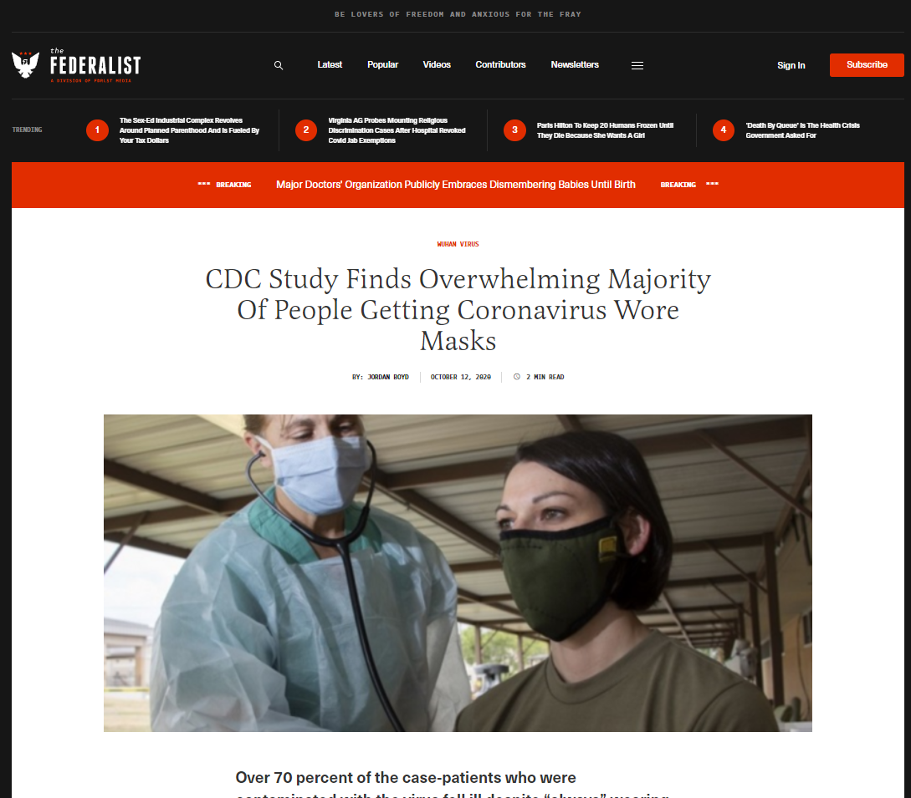

# Ejercicio práctico: contrainformación maligna

## Instrucciones:
Utilizará únicamente las estrategias de información contra malignas desarrolladas por la clase para abordar los siguientes escenarios.

## Escenario:

Transcripción de la imagen: Globo de California
### Titular:
Un nuevo estudio de los CDC encuentra que la mayoría de las personas infectadas con COVID-19 'siempre' usaron máscaras

### Párrafo:
Una vez más parece que hay hechos, datos y muchas opiniones contradictorias sobre la eficacia del uso de mascarillas para prevenir el contagio del Coronavirus.

Además de causar “né de máscara” e infecciones de la piel en la cara y alrededor de la boca, tos persistente, “boca con máscara” y enfermedades respiratorias, incluidas infecciones pulmonares, resulta que la mayoría de las personas infectadas con COVID-19 “siempre” usaron máscaras. según un estudio recientemente publicado por el Centro para el Control y la Prevención de Enfermedades.

Transcripción de imagen: El Federalista
### Titular:
Un estudio de los CDC encuentra que una abrumadora mayoría de las personas que contrajeron el coronavirus usaban máscaras

### Párrafo:
Más del 70 por ciento de los casos infectados con el virus en plena capacidad informaron que llevaban mascarillas.

## Contexto
En octubre de 2020, se publicaron publicaciones en las redes sociales y artículos que afirmaban que un nuevo estudio de los CDC encontró que la mayoría de las personas infectadas con COVID-19 "siempre" usaban máscaras (ejemplos de los artículos a continuación). Esta afirmación se elevó aún más el 15 de octubre de 2020, en una asamblea pública transmitida por NBC, en la que se entrevistó al presidente de Estados Unidos, Donald Trump. Durante esta entrevista, Trump declaró: "Pero el otro día, salieron con una declaración de que el 85% de las personas que usan máscaras se contagian". La fuente de Trump para esta afirmación fue el nuevo estudio publicado por los CDC. La transcripción completa de esta entrevista se puede encontrar aquí. Esta información finalmente fue malinterpretada. A continuación se muestra el tweet de los CDC que aborda la información errónea.

Transcripción de la imagen: Tweet de los CDC

> @CDCgov • Seguir
Respondiendo a @CDCgov
Un @CDCMMWR reciente que analizó la exposición entre personas con y sin #COVID19 también evaluó las tasas de uso de mascarillas. Sin embargo, la interpretación de que se están infectando más personas que usan mascarillas en comparación con quienes no las usan es incorrecta. bit.ly/MMWR91020b

> @CDCgov • Seguir
Las personas con y sin #COVID19 tuvieron altos niveles de uso de mascarillas en público. Incluso para aquellos que siempre usan mascarilla, hay actividades en las que no se puede usar mascarilla, como comer o beber. Las personas con COVID-19 tenían más probabilidades de haber comido en un restaurante.
2:00 p.m. • 14 de octubre de 2020|