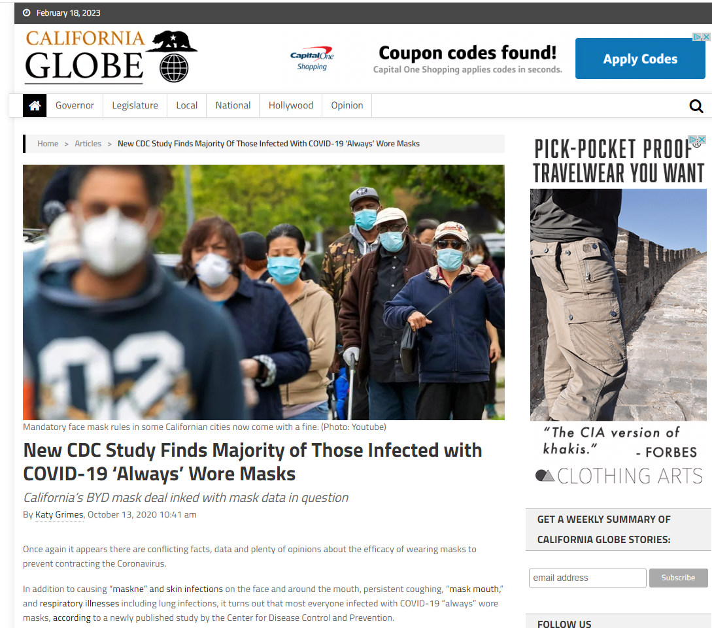
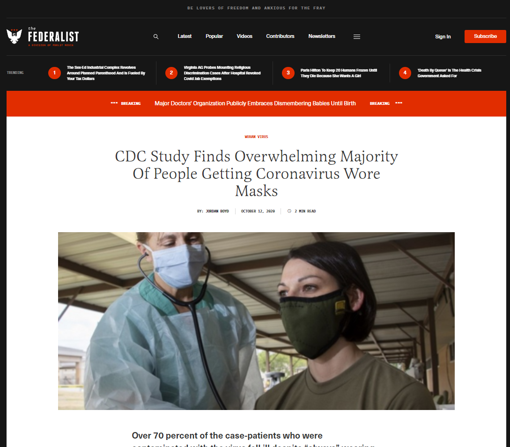
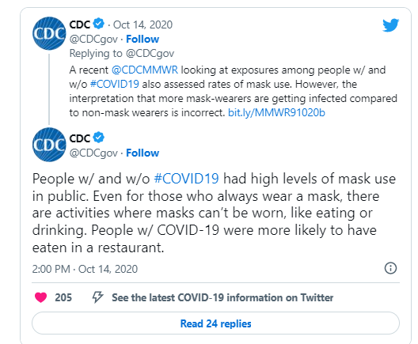

# Lesson Plan: Identifying Misinformation and Disinformation

## SECTION 0: LESSON OVERVIEW

### Lesson Information

**Lesson Title**: Identifying Misinformation and Disinformation

**Program of Instruction (POI)**: Countering Malign Influence / Version 1.0

**Developer Point of Contact**: issac.alfaro@socom.mil

### IMPORTANT

#### Training Material Classification: UNCLASSIFIED

### Distribution Restriction:

- A. Approved for public release; distribution is unlimited.

### Destruction Notice: 

- N/A for the project: automatically rendered based on Distribution Restriction

### Foreign Disclosure:

- FD1 - This training product has been reviewed by the training developer in coordination with the U.S. Army Training and Doctrine Command foreign disclosure officer. This training product can be used to instruct international military students in all approved countries.

### SCOPE OF LESSON

This 2-hour lesson is an advanced level orientation to identifying misinformation and disinformation. The end state of this lesson is for students to accurately identify misinformation and disinformation with a success rate of 90% within 24 hours of detection. The author's intent is that students learn to apply structured analytic techniques to detect potential deception and validate information sources. By the end of the lesson, students should have a solid grasp of the methods used to discern true information from falsehoods. This lesson is critical for operational effectiveness in information operations and links to other parts of the curriculum by reinforcing information analysis and validation skills.

### Learning Objectives

#### Terminal Learning Objective (TLO):

> **Action**: Identify misinformation and disinformation  
> **Condition**: Given a variety of information sources and the presence of suspicious information.  
> **Standard**: Accurately identify misinformation and disinformation with a success rate of 90% within 24 hours.

#### Enabling Learning Objective (ELO) / Learning Step Activity (LSA):

> **Action**: Apply structured analytic techniques (SATs) to detect potential deception  
> **Condition**: Provided with information sources and verification tools.  
> **Standard**: Correctly apply structured analytic techniques to identify misinformation and disinformation in at least 90% of provided examples.

### References

1. Beebe, S. M., & Pherson, R. H. (2015). *Cases in Intelligence Analysis: Structured Analytic Techniques in Action*.
2. Pherson, R. H., & Heuer, R. J. (2021). *Structured Analytic Techniques for Intelligence Analysis*.
3. China Diplomatic X account - https://x.com/China_Panama
4. BEIJING'S GLOBAL MEDIA INFLUENCE 2022 - https://freedomhouse.org/country/panama/beijings-global-media-influence/2022#footnote3_a2zuib0
5. China y Panamá: pro mutuo beneficio (Translated: China and Panama: for mutual benefit) - https://www.laestrella.com.pa/opinion/columnistas/pro-china-mutuo-panama-EJLE2547
6. Misleading a Pandemic: The Viral Effects of Chinese Propaganda and the Coronavirus - https://ndupress.ndu.edu/Media/News/News-Article-View/Article/2884217/misleading-a-pandemic-the-viral-effects-of-chinese-propaganda-and-the-coronavir/
7. A disinformation and propaganda campaign “that denies and downplays the severity of the incident is growing” - https://hongkongfp.com/2021/06/04/taiwan-group-launches-website-to-counter-tiananmen-massacre-trolls-and-denialism/
8. Factsheet 4: Types of Misinformation and Disinformation - https://www.unhcr.org/innovation/wp-content/uploads/2022/02/Factsheet-4.pdf
9. CWU Disinformation Case Studies - https://libguides.lib.cwu.edu/c.php?g=625394&p=4391900 

## SECTION 1: ADMINISTRATIVE DATA

### Instructional Guidance

**Conduct of Lesson:**  
**NOTE:** Before presenting this lesson, instructors must thoroughly prepare by studying this lesson and identifying reference material.
- Review the Deception Detection techniques and examples. Familiarize yourself with the verification tools and scenarios provided.
- Set up computer and projection equipment. Ensure all required materials and equipment are available and functional.
- Print handouts and visual aids for distribution to students.

### 1. The importance of this lesson: (Why)

Understanding how to identify and analyze misinformation and disinformation is essential for maintaining the integrity of information operations. This skill is crucial for detecting and countering false information, which is vital for effective decision-making and maintaining operational security.

### 2. What we want our students to Achieve: (Outcomes/Standard)

Students will be able to accurately identify misinformation and disinformation using structured analytic techniques. Their assessments must align with the principles and techniques taught in the lesson, achieving a success rate of at least 90%.

### 3. A Possible Technique to Achieve the Outcome

1. Interactive exercises where students analyze and verify information using the Deception Detection framework.
2. Group discussions and reviews to reinforce learning and share analytical strategies.
3. Hands-on practice with verification tools to build confidence and proficiency.

### 4. AAR Guidance for this Lesson

1. Conduct an After Action Review (AAR) immediately following the lesson to discuss what went well, what could be improved, and how the techniques learned can be applied in real-world scenarios.
2. Encourage students to provide feedback on the lesson and the effectiveness of the analytical tools used.

### Lesson Requirements

#### Instructor Requirements

An instructor must:
1. Review the entire lesson plan for each lesson they will cover.
2. Be able to obtain, access, and be familiar with the required material and equipment.
3. Read and understand the referenced material.

An instructor must attend the following training:

1. Unit Technical Exchange training or TRADOC-approved faculty course

An instructor should:

1. Have received this block of instruction as a student
2. Participated in this instruction as an assistant instructor for this lesson
3. Participated in the AAR for this lesson

#### Additional Support

##### Required or Requested Support

1. Technical support to ensure all equipment and tools are functioning correctly.
2. Assistant instructors to facilitate group activities and provide individual support.

##### Guidance for Assistant Instructors

1. Assist with distributing materials and setting up exercises.
2. Provide guidance and support to students during practical exercises, including technical assistance with verification tools.
3. Monitor student progress and provide feedback.

### Equipment and Material Required for Instruction

Lesson Material, Ammo, Expendable, etc.

| Equipment                        | Student Ratio | Instructor Ratio | Quantity | Expendable |
| -------------------------------- | ------------- | ---------------- | -------- | ---------- |
| Computers with internet access   | 1:1           | 1:2              |          | no         |
| Example scenarios                |               |                  | Various  | no         |
| Projector and screen             |               |                  | 1        | no         |
| Handout - Practical Exercise: Counter Malign Information            | 1:1           |                  |          | yes        |
| Handout - Practical Exercise: Counter Malign Information (Answers)   | 1:3           |                  |          | yes        |

### Pre-Requisite Tasks

1. Complete introductory training on information operations and deception detection.
2. Review basic principles of information analysis and validation.

### Knowledge Required

1. Basic understanding of information operations and misinformation.
2. Familiarity with the Deception Detection framework.

### Skills Required

1. Ability to use verification tools for information analysis.
2. Critical analysis and attention to detail.

## Supporting Tasks

### Tasks Taught

1. Identifying misinformation and disinformation.
2. Using structured analytic techniques for information validation.

### Tasks Supported

1. Analytical skills and critical thinking.
2. Information security and integrity.

### Tasks Reinforced

1. Recognition and analysis of misinformation and disinformation.
2. Reporting and documenting findings accurately.

## Lesson Timeline

| Academic (y/n) | Broad Topic                   | EST TIME Min | Methods                        | Slide Range |
| -------------- | ----------------------------- | ------------ | ------------------------------ | ----------- |
| Instructor     |                               | 5            | Instructor Rehearsal           | -           |
| Instructor     |                               | 0            | Classroom Setup                | -           |
| y              | Concrete Experience           | 15           | Spotting Differences           | 1           |
| y              | Publish and Process           | 5            | Discussion on Observations     | 2-3         |
| y              | Generalize New Information    | 50           | Techniques for Detecting AI    | 4-11        |
| y              | Develop                       | 30           | Applying Detection Techniques  | 12-17       |
| y              | Apply                         | 20           | Practical Exercise             | 18-19       |
| y              | Assessment / Check On Learning| 10           | Summary and Feedback           | 20-22       |
| y              | Closing                       | 10           | Final Summary and Closure      | 23-25       |
| y              | Break                         | 5            | Break                          | 26          |

## SECTION 2: LESSON INTRODUCTION

**Concrete Experience / Motivator:**  
NOTE: Concrete experience will get buy-in from students by presenting a challenge which does not have a clear answer but is generally covered by the lesson. 

1. Write down two statements on the whiteboard, both of which are lies, but one is more egregious than the other.
    - Statement 1: "The Earth is flat." (Instructor may create a more egregious lie)
    - Statement 2: "The Earth is a cube." (Instructor may create a less egregious lie)
2. Ask students to identify which statement they believe is true and explain why. Ask students, “What was challenging about determining if the statements on the whiteboard were true or false?” (5 minutes)

NOTE: Go to Slide 1

# Slide 1: Concrete Experience / Motivator
## Concrete Experience
- Statement 1: "The Earth is flat." 
- Statement 2: "The Earth is a cube." 

# Slide 2: Title

# Slide 3: Lesson Objectives
## Instructional Lead-in
- Identify misinformation and disinformation effectively using the Deception Detection Framework and Structured Analytic Techniques (SATs).

# Slide 4: Scope Statement
## Scope of Lesson
- During this 130-minute block of instruction, the students will learn to identify misinformation and disinformation using the skills and frameworks previously covered.

# Slide 5: Covering the Frameworks being used and why
## Terms
- Misinformation: is false or inaccurate information. Examples include rumors, insults, and pranks.
- Disinformation: is deliberate and includes malicious content such as hoaxes, spear phishing, and propaganda.
## Deception Detection Frameworks
- **MOM Framework**: Motive, Opportunity, and Means
- **POP Framework**: Past Opposition Practices
- **MOSES Framework**: Manipulability of Sources
- **EVE Framework**: Evaluation of Evidence

Use these frameworks to analyze and identify misinformation and disinformation effectively in a replicable and structured manner.

References: 
1. Beebe, S. M., & Pherson, R. H. (2015). *Cases in Intelligence Analysis: Structured Analytic Techniques in Action*.
2. Pherson, R. H., & Heuer, R. J. (2021). *Structured Analytic Techniques for Intelligence Analysis*.
3. Factsheet 4: Types of Misinformation and Disinformation - https://www.unhcr.org/innovation/wp-content/uploads/2022/02/Factsheet-4.pdf
4. CWU Disinformation Case Studies - https://libguides.lib.cwu.edu/c.php?g=625394&p=4391900

# Slide 6: Motive, Opportunity, and Means (MOM)
## Memorization: MOM Framework
- **MOM Framework**: Motive, Opportunity, and Means
- **When to use it**: Use when evaluating the likelihood of a source having the motive and means to produce misinformation.
- **Where to use it**: Applicable in scenarios where identifying the intent behind information is crucial.
- **Why to use it**: Helps in understanding the potential reasons and capabilities behind the creation of misinformation.

# Slide 7: Past Opposition Practices (POP)
## Memorization: POP Framework
- **POP Framework**: Past Opposition Practices
- **When to use it**: Use when historical context of misinformation from an adversary is available.
- **Where to use it**: Useful in intelligence and strategic analysis settings.
- **Why to use it**: Helps predict future misinformation strategies based on past behavior.

# Slide 8: Manipulability of Sources (MOSES)
## Memorization: MOSES Framework
- **MOSES Framework**: Manipulability of Sources
- **When to use it**: Use when assessing the reliability and susceptibility of sources to manipulation.
- **Where to use it**: Relevant in journalistic and intelligence analysis.
- **Why to use it**: Ensures the credibility of the information and reduces the risk of accepting manipulated data.

# Slide 9: Evaluation of Evidence (EVE)
## Memorization: EVE Framework
- **EVE Framework**: Evaluation of Evidence
- **When to use it**: Use when analyzing the validity and reliability of evidence presented.
- **Where to use it**: Applicable in any analytical context requiring evidence validation.
- **Why to use it**: Ensures the integrity and accuracy of the conclusions drawn from the evidence.

# Slide 10: Memorization Check: Frameworks
## Activity
- Quick check on learning to gauge memorization of the frameworks.
- Have students write down or verbally list the frameworks and the components of each framework.

- ~~MOM Framework~~
  - ~~Motive, Opportunity, and Means~~
- ~~POP Framework~~
  - ~~Past Opposition Practices~~
- ~~MOSES Framework~~
  - ~~Manipulability of Sources~~
- ~~EVE Framework~~
  - ~~Evaluation of Evidence~~

# Slide 11: Memorization Check: Frameworks (Answers)
## Activity
- Reveal the answers to the students, discussing each framework in detail.
- MOM Framework: Motive, Opportunity, and Means
- POP Framework: Past Opposition Practices
- MOSES Framework: Manipulability of Sources
- EVE Framework: Evaluation of Evidence

### Slide 12: Detailed Analysis: Motive, Opportunity, and Means (MOM)
#### Instructor Activity
**Objective:** To provide students with a comprehensive understanding of the MOM framework and its application in identifying misinformation and disinformation.

**Discussion Points:**

1. **Introduction to the MOM Framework:**
   - **Motive:** Explain that motive refers to the reasons why a source would create and disseminate misinformation or disinformation. Discuss common motives such as political gain, financial profit, or social influence.
   - **Opportunity:** Describe opportunity as the circumstances that allow a source to spread false information. Highlight factors like access to large audiences, timing, and platform availability.
   - **Means:** Clarify that means involve the tools and resources the source has at their disposal to create and distribute misinformation. This can include social media platforms, bot networks, and funding.

2. **Historical and Contemporary Example:**
   - Use China’s disinformation campaign during the COVID-19 pandemic as an example.
   - Discuss in detail:
     - **Motive:** China's motive was to deflect blame and manage its global image.
     - **Opportunity:** The global pandemic created a chaotic information environment, providing an opportunity to influence narratives.
     - **Means:** Utilization of social media, state-run media outlets, and bot networks to disseminate propaganda.

3. **Interactive Scenario Analysis:**
   - Present a real or hypothetical scenario where students must identify the motive, opportunity, and means of a disinformation campaign.
   - Example Scenario: A fabricated news story about a political candidate.
     - **Motive:** Undermine the candidate’s credibility.
     - **Opportunity:** Election season, high media coverage.
     - **Means:** Anonymous social media accounts, viral memes, and fake news websites.

**Activity Instructions:**
   - Divide the students into small groups.
   - Assign each group a different scenario to analyze using the MOM framework.
   - Each group should identify the possible motives, opportunities, and means involved in their scenario.
   - Groups will present their analysis to the class, highlighting how they applied the MOM framework to dissect the disinformation campaign.

### Slide 13: MOM Framework Example
#### Instructor Narrative
**Text:** "China's disinformation campaign during the COVID-19 pandemic."

**Detailed Discussion:**
   - **Impact on Global Perceptions:**
     - Describe how the campaign aimed to shift blame away from China regarding the origins of COVID-19.
     - Discuss the broader implications for international relations and trust in global health information.

   - **Social Media Strategy:**
     - Explain the role of social media in amplifying disinformation.
     - Detail how the removal of 150,000 malicious Chinese accounts by Twitter highlighted the scale of the campaign.
     - Discuss the creation and spread of false narratives praising China’s pandemic response and downplaying the virus’s severity.

   - **Analyzing the Campaign:**
     - Use the MOM framework to break down the campaign:
       - **Motive:** Political and economic stability, positive international image.
       - **Opportunity:** The global crisis and information vacuum.
       - **Means:** Extensive state resources, coordinated social media efforts, and influence over domestic and international media.

**Interactive Discussion:**
   - Encourage students to consider how different motives might alter the nature of disinformation campaigns.
   - Discuss the effectiveness of various means used in disinformation and how they can be countered.

**References:**
   - Misleading a Pandemic: The Viral Effects of Chinese Propaganda and the Coronavirus - [NDUPress Article](https://ndupress.ndu.edu/Media/News/News-Article-View/Article/2884217/misleading-a-pandemic-the-viral-effects-of-chinese-propaganda-and-the-coronavir/)

### Slide 14: Detailed Analysis: Past Opposition Practices (POP)
#### Instructor Activity
**Objective:** To guide students in understanding the historical context of disinformation and how past practices inform current strategies.

**Discussion Points:**
1. **Introduction to the POP Framework:**
   - Explain that POP involves analyzing historical disinformation practices to predict future strategies.
   - Highlight the importance of recognizing patterns and strategies used by adversaries.

2. **Historical Examples:**
   - Discuss the Tiananmen Square protests and Hong Kong protests.
   - Detail how disinformation was used to control narratives and suppress dissent.

**Activity Instructions:**
   - Present scenarios based on historical events.
   - Have students analyze these scenarios using the POP framework to identify likely future disinformation strategies.

**References:**
   - Taiwan group launches website to counter Tiananmen Massacre trolls and denialism - [Hong Kong Free Press](https://hongkongfp.com/2021/06/04/taiwan-group-launches-website-to-counter-tiananmen-massacre-trolls-and-denialism/)

### Slide 15: POP Framework Example
#### Instructor Narrative
**Text:** "Tiananmen Square protests, Hong Kong protests, the Cultural Revolution."

**Detailed Discussion:**
   - Provide a detailed historical context for each event.
   - Analyze how disinformation was employed to shape public perception and suppress opposition.
   - Discuss the evolution of disinformation tactics from these events to present-day strategies.

**Interactive Discussion:**
   - Have students find other historical examples and analyze them using the POP framework.
   - Discuss how understanding past practices can inform current counter-disinformation strategies.

**References:**
   - Taiwan group launches website to counter Tiananmen Massacre trolls and denialism - [Hong Kong Free Press](https://hongkongfp.com/2021/06/04/taiwan-group-launches-website-to-counter-tiananmen-massacre-trolls-and-denialism/)

### Slide 16: Detailed Analysis: Manipulability of Sources (MOSES)
#### Instructor Activity
**Objective:** To teach students how to assess the credibility and susceptibility of sources to manipulation.

**Discussion Points:**
1. **Introduction to the MOSES Framework:**
   - Explain that MOSES helps assess the reliability and manipulability of sources.
   - Discuss factors such as source credibility, potential biases, and historical accuracy.

2. **Interactive Scenario Analysis:**
   - Present scenarios where students must evaluate sources using the MOSES framework.
   - Example Scenario: An anonymous whistleblower’s claim about government corruption.

**Activity Instructions:**
   - Have students identify credible vs. manipulable sources within the scenario.
   - Discuss the impact of source credibility on the acceptance of information.

### Slide 17: Detailed Analysis: Evaluation of Evidence (EVE)
#### Instructor Activity
**Objective:** To provide students with the skills to critically evaluate the validity and reliability of evidence.

**Discussion Points:**
1. **Introduction to the EVE Framework:**
   - Explain that EVE is used to analyze the strength of evidence.
   - Discuss criteria for strong vs. weak evidence.

2. **Examples of Evidence:**
   - Provide examples of strong evidence (multiple corroborating sources, verifiable data) and weak evidence (single unverified source, emotional appeal).

**Activity Instructions:**
   - Have students analyze a given scenario using the EVE framework.
   - Discuss the differences between strong and weak evidence.

### Slide 18: EVE Framework Example
#### Instructor Narrative
**Text:** "The Earth is flat." vs. "The Earth is a sphere."

**Detailed Discussion:**
   - Present the arguments for both statements.
   - Analyze the evidence supporting each statement using the EVE framework.

**Interactive Discussion:**
   - Encourage students to critically evaluate the evidence presented.
   - Discuss how to distinguish between strong and weak evidence in various contexts.

# Slide 19: Practical Exercise: Identify Misinformation and Disinformation
## Activity
1. Divide students into groups numbering 1 & 2 as many as possible.
2. Provide each group with Handout - Practical Exercise: Counter Malign Information.
3. Have each group apply the frameworks to their analysis.
4. Each group presents their findings to the class.
5. Discuss and provide feedback on their analyses.
6. Provide the Handout - Practical Exercise: Counter Malign Information (Answers) for review in groups. 

# Slide 20: Summary of Learning Activities
## Summary
- Review the key points from each framework.
- Emphasize the importance of the skills and knowledge gained.

# Slide 21: Check on Learning
## Assessment / Check On Learning
- Question: What is the MOM framework?
  - **Answer**: Motive, Opportunity, and Means.
- Question: What is the POP framework?
  - **Answer**: Past Opposition Practices.
- Question: What is the MOSES framework?
  - **Answer**: Manipulability of Sources.
- Question: What is the EVE framework?
  - **Answer**: Evaluation of Evidence.

# Slide 22: Check on Learning (Revealed)
## Assessment / Check On Learning
- ~~Question: What is the MOM framework?~~
  - **~~Answer~~**: ~~Motive, Opportunity, and Means.~~
- ~~Question: What is the POP framework?~~
  - **~~Answer~~**: ~~Past Opposition Practices.~~
- ~~Question: What is the MOSES framework?~~
  - **~~Answer~~**: ~~Manipulability of Sources.~~
- ~~Question: What is the EVE framework?~~
  - **~~Answer~~**: ~~Evaluation of Evidence.~~

# Slide 23: Why is it Important?
Ask students to reflect on the importance of identifying misinformation and disinformation in their professional and personal lives.

# Slide 24: Lesson Summary
## Review and Summary
- During this block of instruction, we covered:
  - Key learning step activity 1: MOM framework.
  - Key learning step activity 2: POP framework.
  - Key learning step activity 3: MOSES framework.
  - Key learning step activity 4: EVE framework.
- Questions?

# Slide 25: Closing
## Closing Remarks and References
- Recap the importance of identifying misinformation and disinformation.
- Encourage students to apply these skills in their professional and personal lives.
- End of the lesson.

1. Beebe, S. M., & Pherson, R. H. (2015). *Cases in Intelligence Analysis: Structured Analytic Techniques in Action*.
2. Pherson, R. H., & Heuer, R. J. (2021). *Structured Analytic Techniques for Intelligence Analysis*.
3. China Diplomatic X account - https://x.com/China_Panama
4. BEIJING'S GLOBAL MEDIA INFLUENCE 2022 - https://freedomhouse.org/country/panama/beijings-global-media-influence/2022#footnote3_a2zuib0
5. China y Panamá: pro mutuo beneficio (Translated: China and Panama: for mutual benefit) - https://www.laestrella.com.pa/opinion/columnistas/pro-china-mutuo-panama-EJLE2547
6. Misleading a Pandemic: The Viral Effects of Chinese Propaganda and the Coronavirus - https://ndupress.ndu.edu/Media/News/News-Article-View/Article/2884217/misleading-a-pandemic-the-viral-effects-of-chinese-propaganda-and-the-coronavir/
7. A disinformation and propaganda campaign “that denies and downplays the severity of the incident is growing,” - https://hongkongfp.com/2021/06/04/taiwan-group-launches-website-to-counter-tiananmen-massacre-trolls-and-denialism/
8. Factsheet 4: Types of Misinformation and Disinformation - https://www.unhcr.org/innovation/wp-content/uploads/2022/02/Factsheet-4.pdf

# Slide 26: Take a Break
## Break Time

## SECTION 4: SUMMARY

During this block of instruction, we have learned how to detect and analyze misinformation and disinformation using structured analytic techniques. You now have the skills to validate information sources and understand the importance of maintaining the integrity of information operations.

**Method of Instruction (MOI):** Discussion (small or large group)

### Check on Learning

**Question:** Why is it important to be able to identify misinformation and disinformation?
- **Answer:** To maintain operational security and effectively counter false information.

### Review/Summary

During this block of instruction, we covered the Deception Detection framework and its application in analyzing misinformation and disinformation, and participated in practical exercises to apply these techniques.

## SECTION 5: STUDENT EVALUATION

### Testing Requirement

Students must demonstrate their ability to identify misinformation and disinformation by completing a practical exercise and achieving a success rate of at least 90%.

### Student Feedback Requirement

Feedback is essential to effective learning. Schedule and provide feedback on the evaluation and any information to help answer class questions about the test. Provide remedial training as needed.

## APPENDIX A - Audio Visual Masters

### Required Audio-Visual Material and Handouts

| Sequence | Media Name                       | Attachment or URL | Media Type |
| -------- | -------------------------------- | ----------------- | ---------- |
| -        | Master Slide Deck - Deception Detection Framework |                   | ZIP        | 
| -        | Handout - Practical Exercise: Counter Malign Information |                   | PDF        |
| -        | Handout - Practical Exercise: Counter Malign Information (Answers) |                   | PDF        |
| -        | Handout - Scenario 1 |                   | PPT        |

## APPENDIX B - Assessment Statement and Assessment Plan

### Assessment Statement

Students will be assessed on their ability to identify and analyze misinformation and disinformation. The assessment will involve practical exercises where students must apply the Deception Detection framework and achieve a success rate of at least 90%.

### Assessment Plan

The assessment procedures will include practical exercises, performance checklists, and constructive feedback. Students will be required to demonstrate their proficiency in identifying misinformation and disinformation and report their findings accurately.

## APPENDIX C - Practical Exercises and Solutions

## Scenario:

In October 2020, posts on social media and articles were published claiming that a new CDC study found the Majority of those infected with COVID-19 ‘always’ wore Masks (examples of the articles below). This claim was further elevated on October 15, 2020, a town hall broadcast by NBC, interviewed U.S. President Donald Trump. During this interview Trump stated, " But just the other day, they came out with a statement that 85% of the people that wear masks catch it." Trump's source for this claim was the new study published by the CDC. Full transcription of this interview can be found here. This information was ultimately, misinterpreted. Below is the CDC's tweet addressing the misinformation.

#### Objective for Students:
Develop a counter-strategy to expose and neutralize the disinformation campaign by CountryX. Ensure the strategy includes:
- Collecting and presenting evidence to refute the false claims.
- Engaging with international media and stakeholders to provide accurate information.
- Coordinating with social media platforms to identify and remove fake accounts and bots.
- Leveraging diplomatic channels to address the disinformation at the international level.

### NOTE: 
This scenario is fictional and for educational purposes only. It does not reflect real-world events or entities. Researching or obtaining information about the event is not required. The focus is on developing a strategic response to the scenario presented - developing the HOW rather than the WHAT. Detailed steps that someone else from your unit could follow without needing further explanation is the goal.
