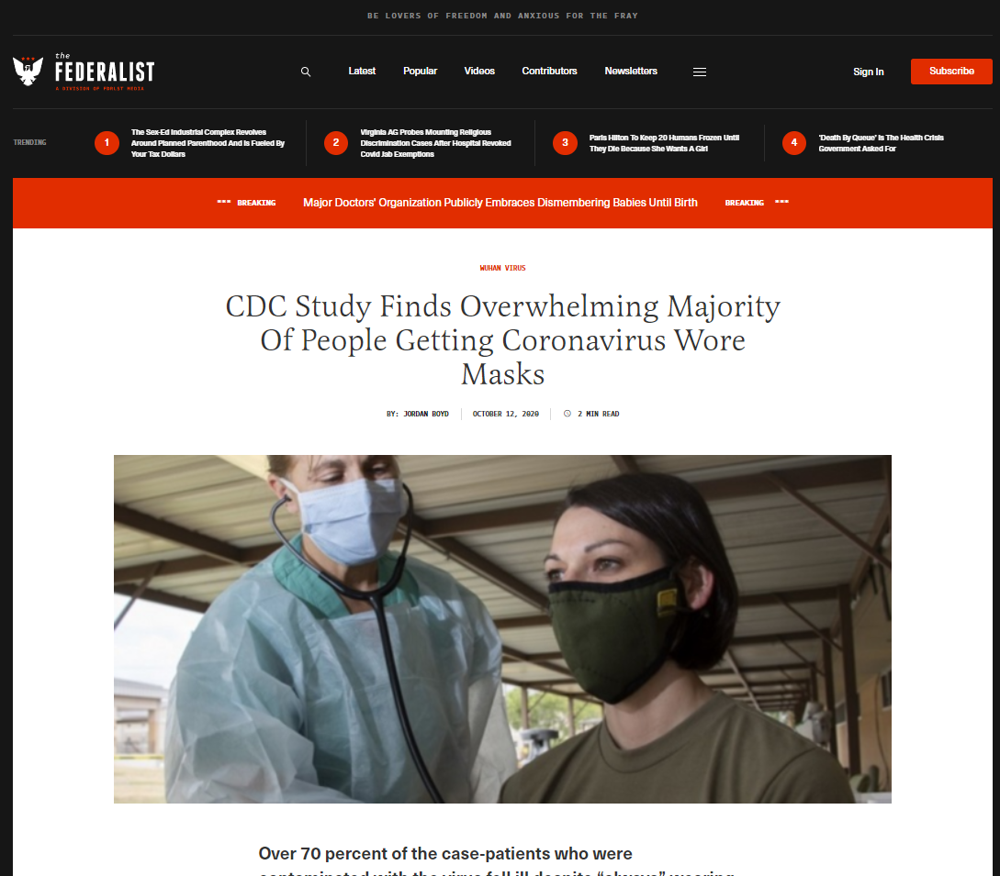

# Practical Exercise - Counter Malign Information

## Instructions:
You will use only the counter-malign inforamtion strategies developed by the class to address the following scenarios.

## Scenario:

Image Transcription: California Globe
### Headline:
New CDC Study Finds Majority of Those Infected with COVID-19 ‘Always’ Wore Masks

### Paragraph:
Once again it appears there are conflicting facts, data and plenty of opinions about the efficacy of wearing masks to prevent contracting the Coronavirus.

In addition to causing “maskne” and skin infections on the face and around the mouth, persistent coughing, “mask mouth,” and respiratory illnesses including lung infections, it turns out that most everyone infected with COVID-19 “always” wore masks, according to a newly published study by the Center for Disease Control and Prevention.

Image Transcription: The Federalist
### Headline:
CDC Study Finds Overwhelming Majority Of People Getting Coronavirus Wore Masks

### Paragraph:
Over 70 percent of the case-patients who were contaminated with the virus of full capacity reported wearing masks.

## Context 
In October 2020, posts on social media and articles were published claiming that a new CDC study found the Majority of those infected with COVID-19 ‘always’ wore Masks (examples of the articles below). This claim was further elevated on October 15, 2020, a town hall broadcast by NBC, interviewed U.S. President Donald Trump. During this interview Trump stated, " But just the other day, they came out with a statement that 85% of the people that wear masks catch it." Trump's source for this claim was the new study published by the CDC. Full transcription of this interview can be found here. This information was ultimately, misinterpreted. Below is the CDC's tweet addressing the misinformation.

Image Transcription: CDC Tweet

> @CDCgov • Follow
Replying to @CDCgov
A recent @CDCMMWR looking at exposures among people w/ and w/o #COVID19 also assessed rates of mask use. However, the interpretation that more mask-wearers are getting infected compared to non-mask wearers is incorrect. bit.ly/MMWR91020b

> @CDCgov • Follow
People w/ and w/o #COVID19 had high levels of mask use in public. Even for those who always wear a mask, there are activities where masks can't be worn, like eating or drinking. People w/ COVID-19 were more likely to have eaten in a restaurant.
2:00 PM • Oct 14, 2020|